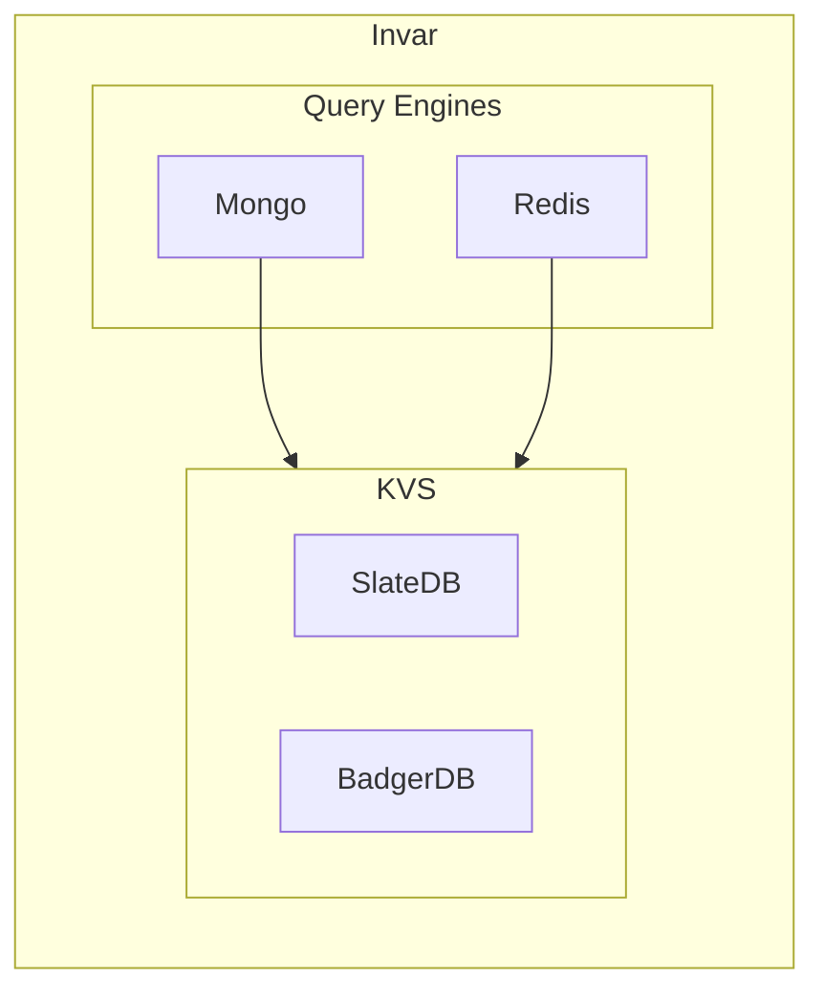

# Invar


 

## Overview

Invar is a lightweight durable document database. Its main goals are:

* Lightweight single binary
* Simple consistency & durability guarantees
* Compatibility with RESP and Mongo Wire Protocols
* Open: Apache 2.0-licensed

It supports clients which speak the Redis Serialization Protocol (RESP), and has incubating support for MongoDB client drivers.

If you need to store JSON documents reliably, without the complexity or licensing constraints of other systems, try Invar.

## Backed by Hardpoint

Invar is backed by [Hardpoint Labs](https://hardpoint.dev) and powers our enterprise products. If you need to offer comprehensive tenant isolation for enterprise customers without throwing away your existing stack, [give us a try](https://docs.hardpoint.dev/who-is-hardpoint-for).

---

## Getting started

We ship Docker builds of our latest releases which you can pull and run as a 1-liner:

```
docker run -it -v /tmp:/var/run/invar -p 6379:7379 ghcr.io/hardpointlabs/invar:latest redis badger --data-dir /var/run/invar
```

### Redis client compatibility

See the [compatibility](./COMPATIBILITY.md) docs for more details.

### Mongo driver compatibility

We're still working on a stable release with Mongo wire protocol support; please create an [issue](https://github.com/hardpointlabs/invar/issues) if this is something you're interested in.

## Architectural Overview


