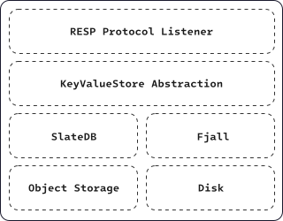

<div align="center">
  <a href='https://hardpoint.dev/?utm_source=github'>
    </img>
  </a>
</div>

---

# Invar

[](LICENSE)   

Invar is a diskless, Redis™-compatible document store.

It speaks Redis' RESP wire protocol and gives well-defined durability + transactional behavior, without having to manage disks.  It uses object storage, meaning your cloud bill scales with what you store, not what you provision.
It's explicitly designed for single-writer operation and to run at fleet-scale for instance-per-tenant scenarios. Have a read of [this post](https://blog.hardpoint.dev/announcing-invar-a-diskless-transactional-document-db?utm_source=github) for more context about Invar's evolution.

Check out the [docs](https://docs.hardpoint.dev/guides/invar) for more details.

---

## Why Invar

- **Redis wire protocol compatibility:** Works with your existing code. Compatibility is verified continuously against a suite of integration tests for the command spec. See the [compatibility guide](https://docs.hardpoint.dev/guides/invar/appendix/redis-tm-command-support) for more details
- **Diskless by design:** Invar uses [SlateDB](https://slatedb.io) under the hood. Data lives in S3. No replication issues, capacity planning, e.t.c
- **Defined transactional guarantees:** Invar targets snapshot isolation, with merge support incubating
- **Single binary:** One process, no cluster coordination
- **Real local dev experience:** Can persist to disk for simplified local dev & CI, without an S3 service dependency
- **Apache 2.0:** Committed to open source

### Architecture

<div align="center">
  </img>
</div>

## Quickstart

### Local FS

This boots up an instance persisting data to `/tmp/invar`:

```bash
docker run -v /tmp/invar:/tmp/invar -p 6379:6379 -it ghcr.io/hardpointlabs/invar:latest --backend fjall --path /tmp/invar
```

#### S3

Pass the usual `AWS_...` variables to configure Invar to run backed by object storage:

```bash
docker run -v /tmp/invar:/tmp/invar -e AWS_REGION=... -e AWS_ACCESS_KEY_ID=...\
  -e AWS_SECRET_ACCESS_KEY=... -p 6379:6379 -it ghcr.io/hardpointlabs/invar:latest \
  --backend slate --bucket <my-bucket-name>
```

## Compatibility

Invar implements a broad, actively-tested subset of the Redis command set. See [COMPATIBILITY.md](COMPATIBILITY.md) for the full list and known gaps.

## Local development and contributions

See [CONTRIBUTING.md](CONTRIBUTING.md) for details about building Invar itself and how you can contribute.

## License

Apache 2.0. See [LICENSE](LICENSE).